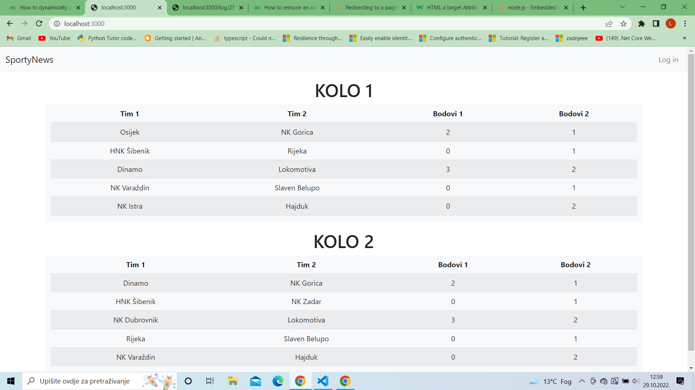
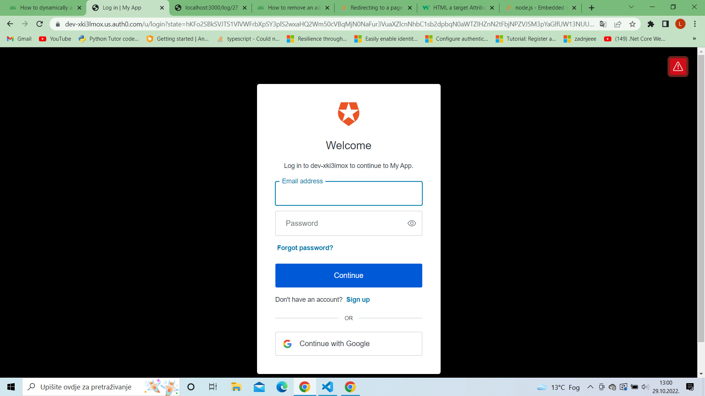
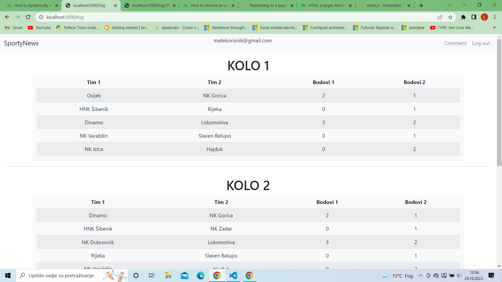
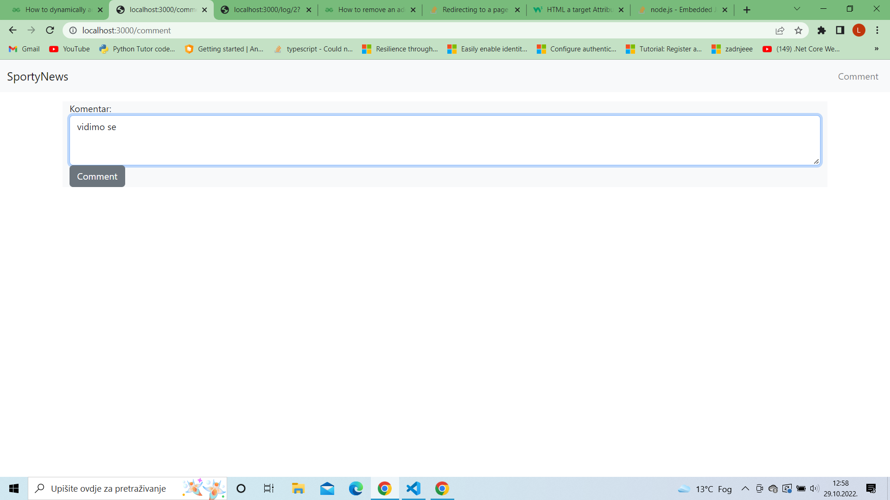
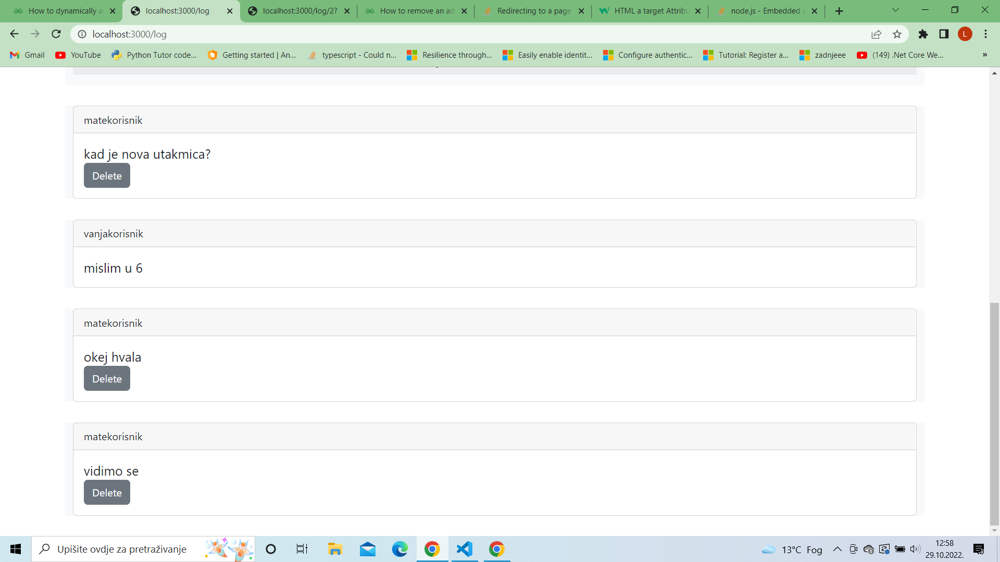
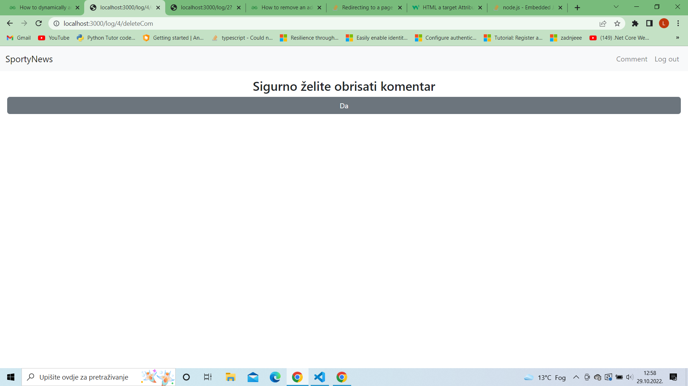
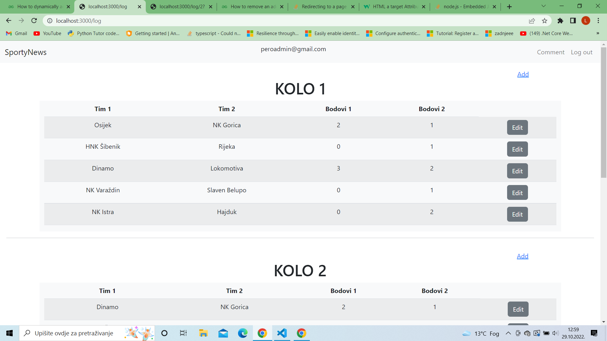
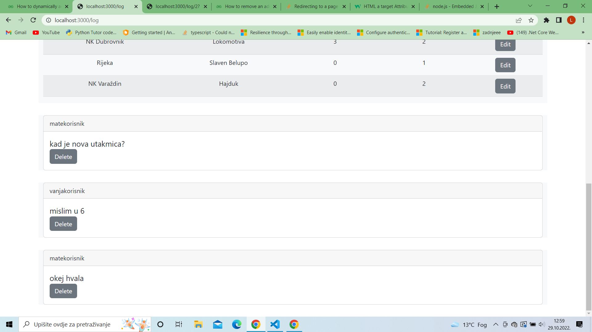

# labos1web2_node

Aplikacija je napravljena s Node.js, a za autentifikaciju se koristi Auth0. Podaci se spremaju u .json datoteke, budući da ih ima nema puno.

Podaci za prijavu:
| mail | lozinka | uloga |
| ------------- | ------------- | ------------- |
| peroadmin@gmail.com  | Pero123!  | admin |
| matekorisnik@gmail.com  | Mate123!  | korisnik |
| vanjakorisnik@gmail.com  | Vanja123!  | korisnik |

__Prikaz za neprijavljenog korisnika__

__Prijava (klik na Log in)__

__Prikaz za prijavljenog korisnika__

__Dodavanje komentara (klik na Comment)__

__Prikaz komentara za korisnika (može obrisati samo svoje)__

__Brisanje komentara (klik na Delete)__

__Prikaz za admina (može dodavati u tablicu i editati ju)__

__Prikaz za admina (može bisati sve komentare, ne samo svoje)__

